# Tugas Praktikum 8 (Pertemuan ke 10) 

|Nama|NIM|Kelas|Mata Kuliah|
|----|---|-----|------|
|**Radityatama Nugraha**|**312310644**|**TI.23.A3**|**Manajemen Basis Data**|

# Soal 1:
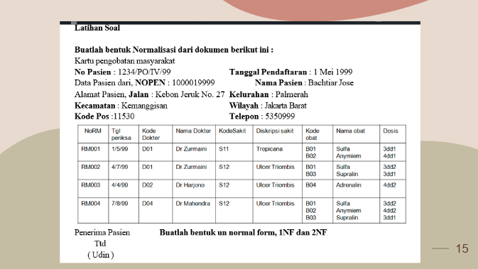

## - Bentuk 1NF (First Normal Form)
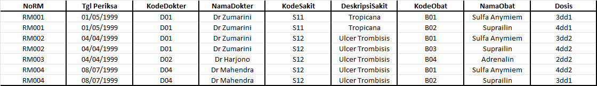

## - Bentuk 2NF (Second Normal Form)

## - Untuk Memulai Codingan Database di XAMPP dan ke Shell
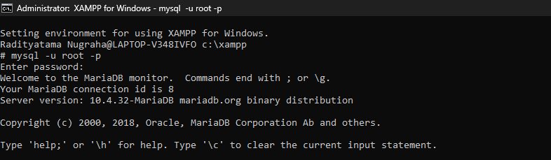

## - Membuat dan memilih database klinik dengan perintah CREATE DATABASE klinik; dan USE klinik;.

## - Membuat tabel Pasien di dalam database klinik menggunakan perintah CREATE TABLE, yang berfungsi untuk menyimpan data pasien seperti nomor rekam medis (NoRM), nama, alamat, wilayah, nomor pasien, dan tanggal daftar; dengan NoRM sebagai primary key untuk memastikan setiap pasien memiliki identitas.
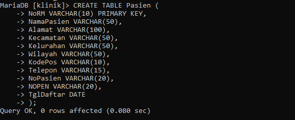

## - Membuat tabel Dokter di dalam database klinik menggunakan perintah CREATE TABLE, yang berfungsi untuk menyimpan data dokter seperti kode dokter sebagai primary key dan nama dokter sebagai identitas tambahan.
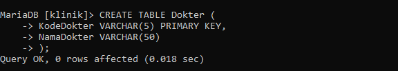

## - Membuat tabel Sakit di dalam database klinik menggunakan perintah CREATE TABLE, yang bertujuan untuk menyimpan data jenis penyakit dengan kolom KodeSakit sebagai primary key dan DeskripsiSakit sebagai penjelasan nama atau gejala penyakit.
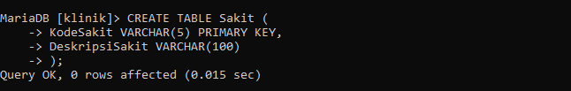

## - Membuat tabel Obat di dalam database klinik menggunakan perintah CREATE TABLE, yang bertujuan untuk menyimpan data obat dengan kolom KodeObat sebagai primary key dan NamaObat sebagai nama atau jenis obat yang tersedia di klinik.
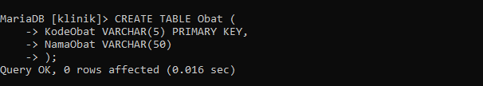

## - Membuat tabel Pemeriksaan di dalam database klinik menggunakan perintah CREATE TABLE, yang berfungsi untuk mencatat data pemeriksaan pasien, termasuk tanggal periksa, dokter yang menangani, penyakit yang didiagnosis, dan obat yang diberikan; dengan beberapa kolom seperti NoRM, KodeDokter, KodeSakit, dan KodeObat yang terhubung ke tabel lain melalui foreign key untuk menjaga integritas data antar tabel.
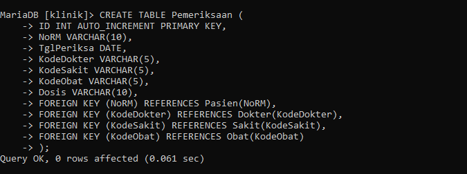

## - Menampilkan seluruh tabel yang ada di dalam database klinik menggunakan perintah SHOW TABLES;, yang hasilnya menunjukkan lima tabel: dokter, obat, pasien, pemeriksaan, dan sakit—menandakan struktur data klinik sudah lengkap untuk mencatat informasi medis secara terintegrasi.
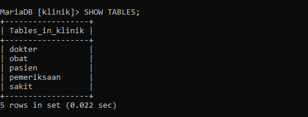

## - Melakukan input data pasien ke dalam tabel Pasien di database klinik menggunakan perintah INSERT INTO, lalu menampilkan seluruh isi tabel dengan SELECT * FROM Pasien; untuk memastikan data seperti NoPasien, nama, alamat, dan tanggal daftar berhasil tersimpan dan ditampilkan.
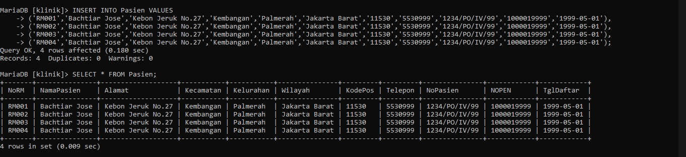

## - Melakukan input data dokter ke dalam tabel Dokter di database klinik menggunakan perintah INSERT INTO, lalu menampilkan seluruh isi tabel dengan SELECT * FROM Dokter; untuk memastikan data seperti KodeDokter dan NamaDokter berhasil tersimpan dan ditampilkan.
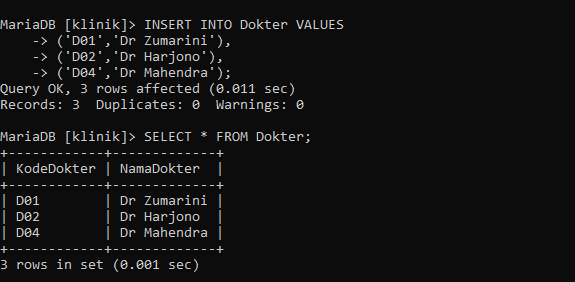

## - Melakukan input data penyakit ke dalam tabel Sakit di database klinik menggunakan perintah INSERT INTO, lalu menampilkan seluruh isi tabel dengan SELECT * FROM Sakit; untuk memastikan data seperti KodeSakit dan DeskripsiSakit berhasil tersimpan dan ditampilkan.
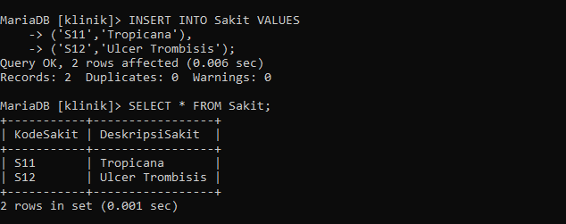

## - Melakukan input data obat ke dalam tabel Obat di database klinik menggunakan perintah INSERT INTO, lalu menampilkan seluruh isi tabel dengan SELECT * FROM Obat; untuk memastikan data seperti KodeObat dan NamaObat berhasil tersimpan dan ditampilkan.
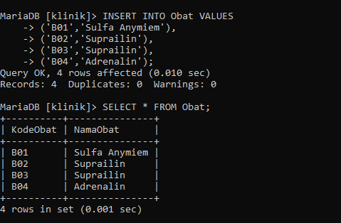

## - Melakukan input data pemeriksaan pasien ke dalam tabel Pemeriksaan di database klinik menggunakan perintah INSERT INTO, lalu menampilkan seluruh isi tabel dengan SELECT * FROM Pemeriksaan; untuk memastikan data seperti NoRM, TglPeriksa, KodeDokter, KodeSakit, KodeObat, dan Dosis berhasil tersimpan dan ditampilkan sesuai relasi antar tabel.
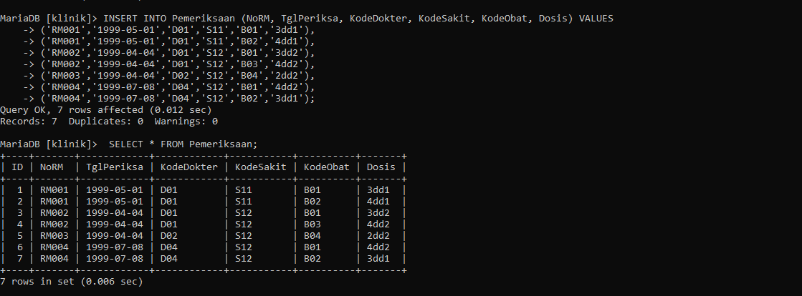

